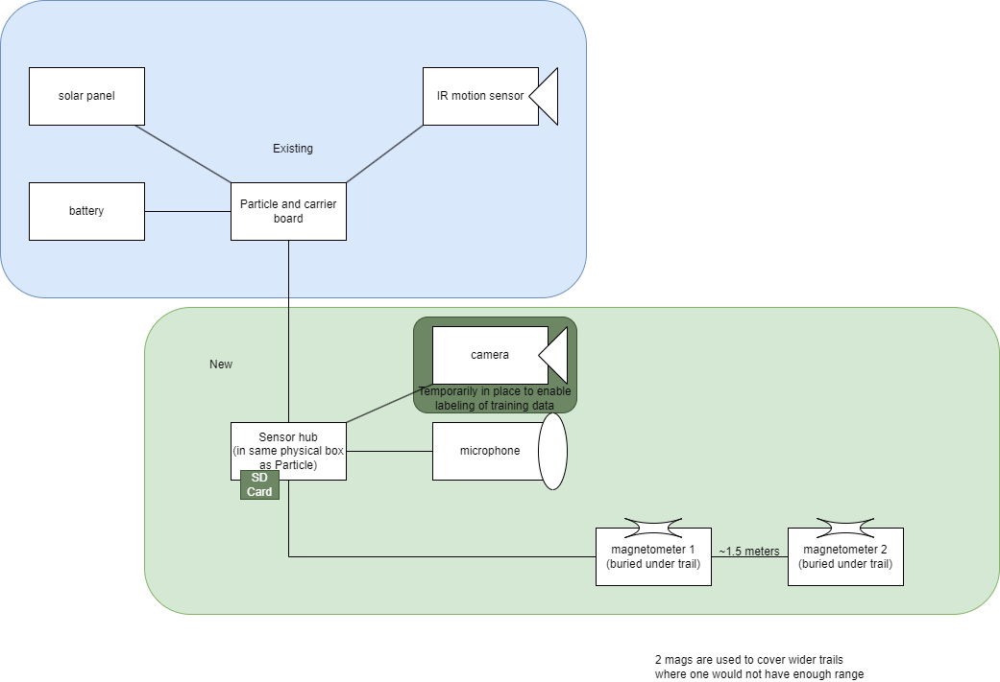
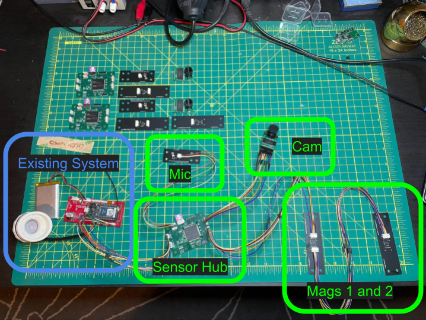

## Hardware

  
  
Wires in bench test setup shown above are shorter than the outdoor system will be. The outdoor system will use weatherproof ethernet cables with custom connectors.

* [Sensor Hub](https://365.altium.com/files/BC2960F7-2C5C-4D8B-A55F-29FE89FE0900)
* [Microphone](https://365.altium.com/files/D665B4D2-95BA-4854-9D05-94442396BC4B)
* [Magnetometer](https://365.altium.com/files/593CDE44-55BD-4C96-BCC8-DDE9FC3A4117)
* [Arducam mini OV2640 2MP](https://www.amazon.com/dp/B012UXNDOY?psc=1&ref=ppx_yo2ov_dt_b_product_details)

## Firmware

The Particle firmware will be configured to supply power to the Sensor Hub for 5 seconds (or until the Sensor Hub indicates it is ready to be shut down) each time the motion sensor is triggered.

### Data Collection

The first phase of the deployment will have the Sensor Hub programmed to collect 2 seconds of data from the microphone and each magnetometer as well as a photograph from the camera. This data will be saved to the SD card. Later, data samples will be manually tagged using the photograph from each event for use in machine learning model training.

### Event Categorization

A subset of the same hardware can be used to do the actual identification simply by updating the firmware on the Sensor Hub and Particle. The Sensor Hub will be programmed to collect sensor data and run the ML model each time it is powered on and then send the results over UART to the Particle (exactly how this works will depend on the results of the model training). The Particle firmware will need to be updated to handle the categorization results from the Sensor Hub.
