## Magnetometer Testing Report Part 1

Testing was done with a [Memsic MMC5983MA magnetometer](./datasheets/Memsic_09102019_MMC5983MA_Datasheet_Rev_A-1635338.pdf) on both the monterey `bike path` and on the `street` near my home. The `bike path` represents more of a real-world scenario while the `street` test was a more controlled environment where I was the one riding the bike and could control the distance between the bike and the sensor. The one drawback to the `street` location was the nearby presence of active power lines and parked cars, however, the disturbance caused by this was quite small.

### Data

The data is presented in 3 formats.
1. As `x`, `y`, and `z` data timeseries.
1. As `x`, `y`, and `z` data timeseries with their means subtracted - thus recentering around 0 to better display time variation.
1. As `x`, `y`, and `z` 3d scatter point clouds to better display total variation. Here, data points are colored by index to give some sense of elapsed time.

Please note that the `street` samples are 2 seconds of data while the `bike path` data is only 1 second.

First, we will look at baseline data from the `bike path` - collected when nothing was happening near the sensor. Second, we look at a best case detection scenario where I rode my bike as close to the sensor as possible at the `street` location. Third, we look at an actual `bike passing` event from the real world `bike path` location.

**Monterey Bike Path Baseline**  
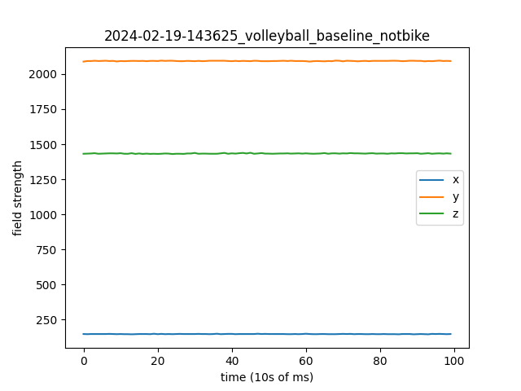  
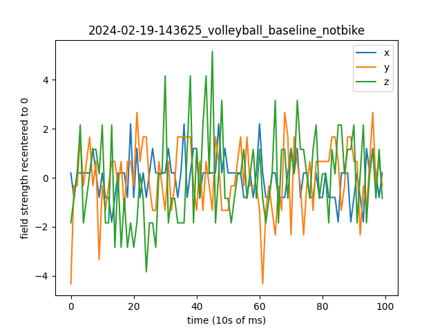  
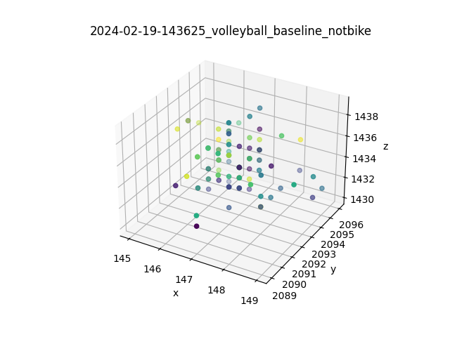  

**Street Close Bike Passing**  
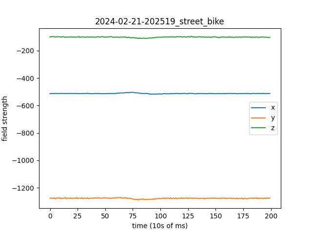  
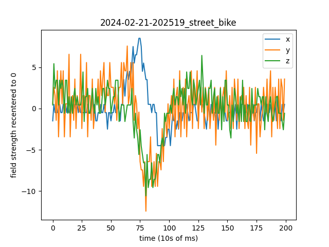  
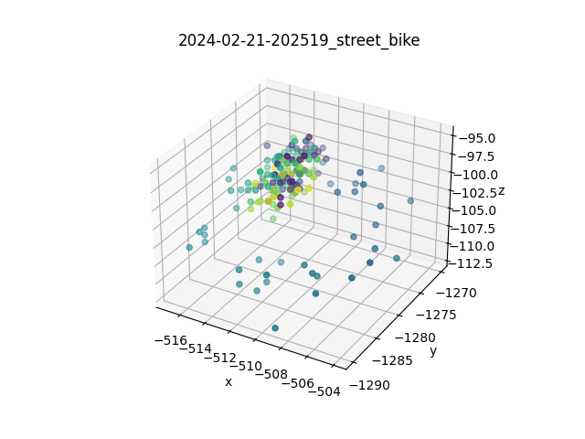 

**Monterey Bike Path Bike Passing**  
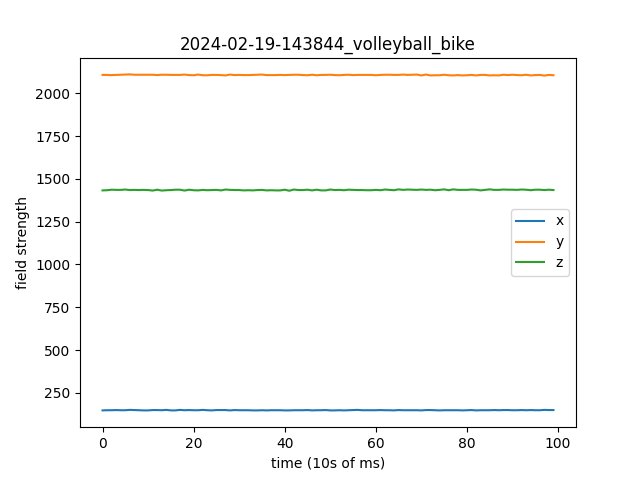  
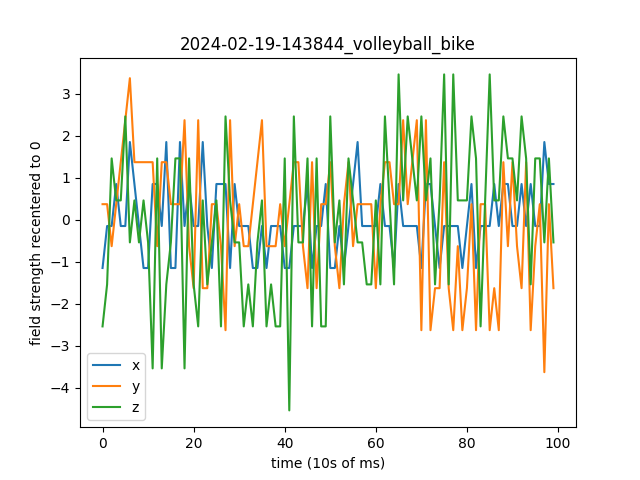  
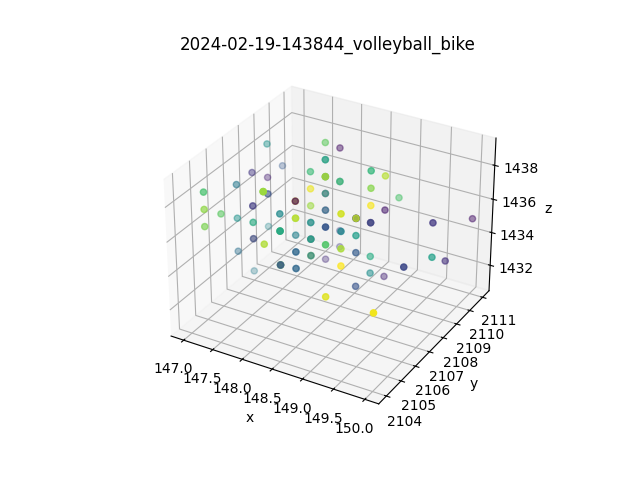  

The steady state values of x, y, and z are simply due to the orientation of the sensor with respect to Earth's magnetic field. The signal we are looking for lies in the changes to these states as a bike passes by. While the signal from the close passing bike is very apparent, it is much more difficult to see anything in the real world bike passing event where the bike is not so close to the sensor.

### Data Processing to Find the Signal

If a ferromagnetic object passes by the sensor, we expect to see changes on all three channels of data. The changes may not match each other in phase or amplitude, but the frequency components should be the same as that is just dependent on the speed and distance of the passing object. Therefore, we want to detect if there is a signal at a given frequency on all three channels. If there is, that indicates a bike has passed. If no bike has passed, we should not expect to find any particular frequency component containing a larger magnitude than the others as that sample should just consist of steady state positions and random noise. With that goal in mind, the following proceedure is proposed:

1. Calculate the FFT (fast Fourier transform) of each `x`, `y`, and `z` channel data series in order to obtain the magnitude of the various frequency components.
1. Retain just the positive frequency components below 30Hz.
1. Elementwise multiply the FFT results from each channel together in order to amplify signals with matching frequencies.
1. Normalize the results. Optionally, smooth the results with a moving average or Gaussian filter for example.
1. Calculate the mean of the normalized results.
1. If the mean is below a certain cutoff (say `0.22`), that indicates that there is a significant peak at one frequency range above all others. This sample can be classified as a bike passing. If the mean is higher than the cutoff, then that indicates that there is no significant peak standing higher than all other frequencies and that no bike passed. Optionally, a more complex classification system could be used that takes in more than just the mean.

Here are two examples of this data processing using the same data samples from the `bike path` in the previous section of this document. The first row of charts is the raw data for `x`, `y`, and `z` channels. The second row is the FFT results for positive frequencies below 30Hz for each channel. The final two charts are the normalized elementwise products of the three channels of FFT results and the same thing if the products undergo Gaussian smoothing before normalization. The mean of all normalized values is displayed on each chart with text color indicating a value above or below `0.22`.

**Monterey Bike Path Baseline FFT Analysis**  
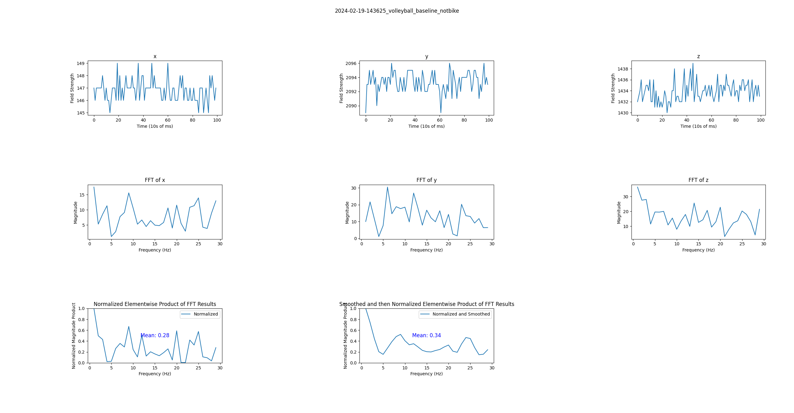  

**Monterey Bike Path Bike Passing FFT Analysis**  
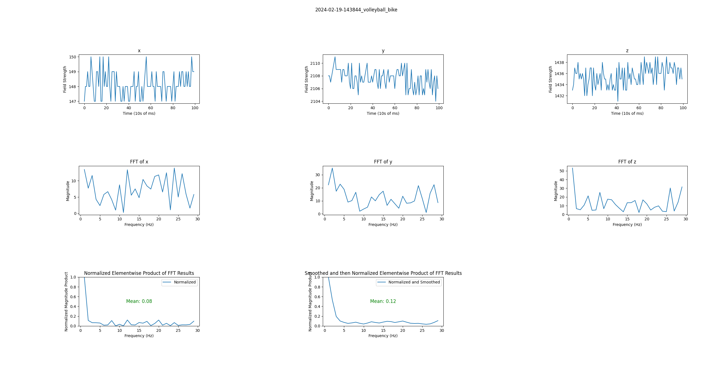  

Running this same processing on all of my samples collected so far yeilds the following results:

|                 |Bike Not Passing| Bike Passing |
|-----------------|----------------|--------------|
|Bike Not Detected|             14 |            7 |
|Bike Detected    |              2 |            8 |

The less than stellar recall (`true positives / total positives` = `8/15`) is not surprising and actually pretty impressive considering the far side of the trail was about 3 meters from the sensor so half of the bikes were at least 1.5 meters from the sensor (see image at the end of this document). The 2 false positives out of 16 total negatives is not bad, but somewhat suprising it was even that high. I'm not sure what would be causing these. Even one of my baseline data samples (not included in the test set above) "detects" a bike which suggests some other environmental issue at play.

### Conclusions and Next Steps

While the signal from the bike is very clear when the bike passes extremely close to the sensor, at just one meter away it is considerably diminished. Clever filtering is required to detect bikes at any useful range. But even so, a meter or two is about the best we can expect.

The [MMC5983MA](./datasheets/Memsic_09102019_MMC5983MA_Datasheet_Rev_A-1635338.pdf) represents the best low-cost magnetometer I could find and it does appear to be good enough to be useful. It costs about $2 each when bought in bulk. Multiple of this cheap sensor may be used across the width of a path in order to improve the effective range.

We need to collect more real-world data, ideally on some actual multi-use mountain bike and hiking trails. Then we can work on improving the data processing and detection algorithm. We should also run controlled tests to quantify just how much range we can actually get out of this system to inform how the sensors should be installed.

Finally, figure out how to integrate our system with existing trail counter hardware/software.

## Appendix

Here is a photo from the monterey `bike path` data collection location. The magnetometer is attached to the section of 2x4 on the ground on the left side of the image.

  